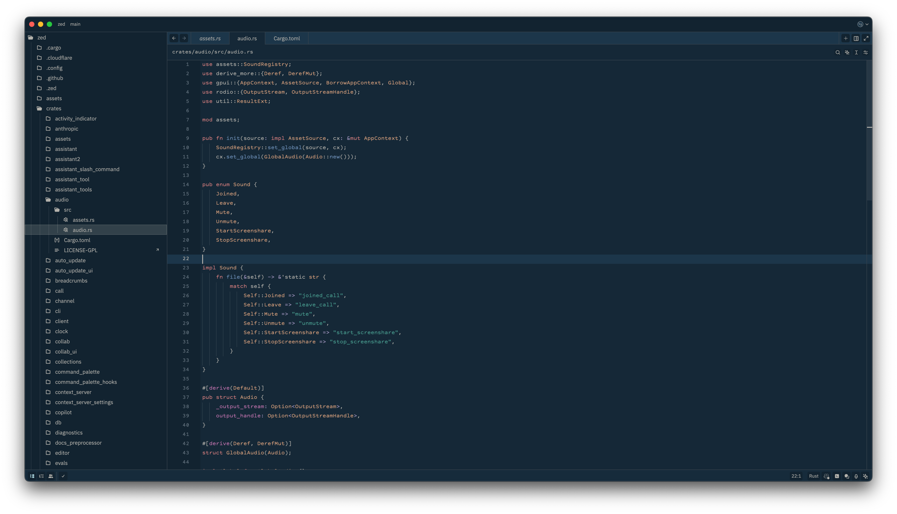
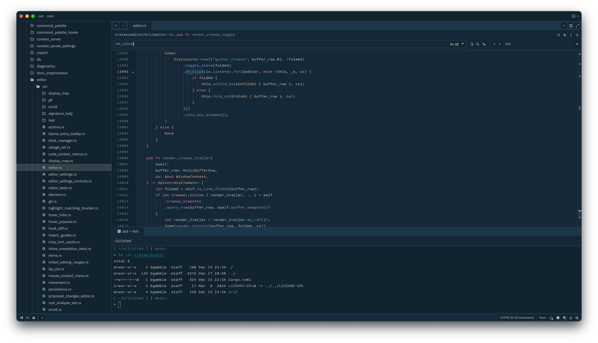
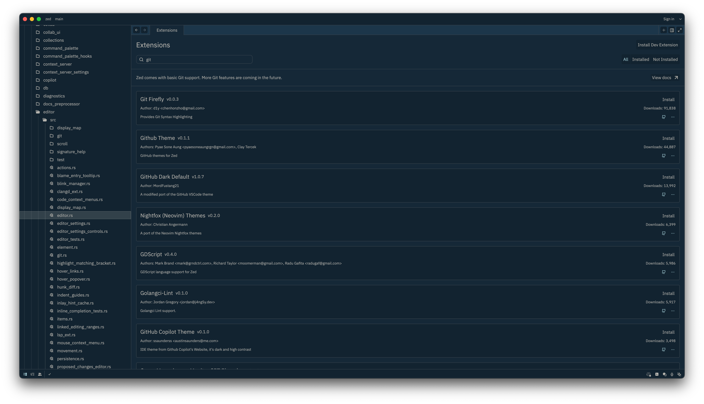
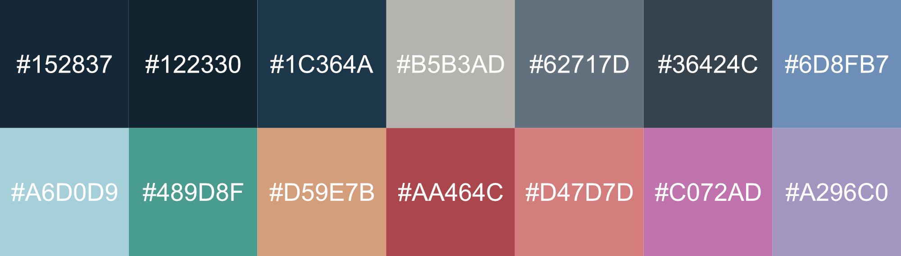

# Gentle Dark Theme

A dark theme for [Zed](https://zed.dev/) inspired by the [Gentle Dark UI theme](https://github.com/gentlelionstudios/gentle-dark-ui-atom) for the Atom IDE.

- [Screenshots](#screenshots)
- [Color Reference](#color-reference)
- [Author](#author)
- [License](#license)

## Screenshots

## Color Reference

## Author
Brian J. Gamble

## License
[MIT License](https://github.com/gentlelionstudios/gentle-dark-zed/blob/master/LICENSE)
